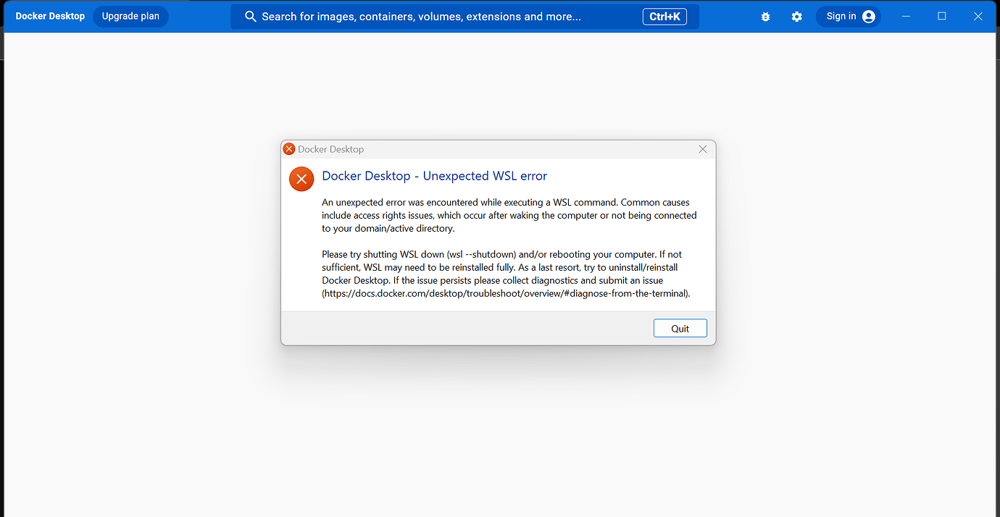

# ECS 171 Group 29 Final Project

## A Quick Note Before Getting Started
The way that this project gets run locally has been updated since it was presented in
our [project demo](https://www.youtube.com/watch?v=9XdZAnf7_PQ). In this new version, instead of independently
installing the dependencies, you will be using Docker Desktop and Docker Compose to build and run the project.
This will automatically install the needed dependencies and set the required environment variables, so that
you just have to use `docker-compose` commands to build and run the project.

All you need to do is install [Docker Desktop](https://www.docker.com/products/docker-desktop/), clone the project,
and open the Docker Desktop app before getting started.

## Project Structure:
```
genre-classification/
|-- client/
|   |-- App.js (contains the main React code for our project)
|   |-- Dockerfile
|   |-- (client files)
|
|-- Dockerfile (for Flask server)
|-- requirements.txt (for Python requirements)
|-- app.py (Flask server)
|-- docker-compose.yml
|-- (other server/ML/data files)
```

## Getting Started
1. Have Docker Desktop installed if you haven't already. The following instructions assume you have installed it
to your machine and opened the app. You may also need to sign in or create an account.
2. In the project's root directory, run `docker-compose build`.
For reference of how long this should take, it takes 1-2 minutes on an Intel Core i5 processor without caching,
but seconds for an Apple Silicon (M1, M2, or M3) processor. This needs to run without failure in order to run the project.
3. In the project's root directory, run `docker-compose up`. This will run the created Docker images for the server
and client in a Docker container - if this runs without error/failure, then the server should now be running on port
5000 and the React client should be running on port 3000.
4. Examine the output of steps 2 and 3 - step 2 should complete and exit without failure, and step 3 will run as long as you
need until you are done interacting with the web app. You are now ready to view the web app - navigate to localhost:3000.

## Interact With the Web App
1. Use any of the testing datasets in `/test_datasets` to pass to our models.
2. Click the `Submit` button.
3. Click `Show Report` under any of the models to view their Classification Report.
4. Feel free to play around with any of the test datasets in the folder.

## Common Issues (Read fully before getting started!)

### If you are running on an Apple M1-M3 Mac:
On an Apple M1-M3 Mac, your Airplay Receiver may already be running on your machine's port 5000. Check if any processes are
running on port 5000 with the following command: `sudo lsof -i -P -n | grep 5000`. You will need to free this port of any
running processes in order for the server to run. If you see a process titled 'Control Center' is running on port 5000, it is
most likely your Airplay Receiver. To temporarily disable this, do the following:
go to `System Preferences` -> go to `Sharing` -> Uncheck `Airplay Receiver`.

### If you are on Windows Using WSL:
There is one extra step you will need to take before following the steps to getting started. First, you need to
install Docker Desktop for Windows. You do not have to install it on WSL. Next, you need to enable
WSL integration on Docker Desktop. To do this:
1. Open Docker Desktop.
2. Got to Settings.
3. Find the section for WSL Integration.
4. Enable integration with your WSL distribution (e.g., Ubuntu).
5. Restart Docker Desktop to ensure that the changes take effect. Also, restart WSL by running `wsl --shutdown`.
6. Reopen your WSL terminal and check if Docker is running:
```bash
docker --version
docker-compose --version
docker ps
```
The above commands should show the Docker version, Docker Compose version, and a list of running Docker containers,
respectively. If you get output running these Docker commands as expected (without failure or error), you are now
ready to get started. Some Windows users may see an unexpected WSL error, as in the following:

This error is discussed at length with several suggestions/fixes at [this forum](https://forums.docker.com/t/an-unexpected-error-was-encountered-while-executing-a-wsl-command/137525).